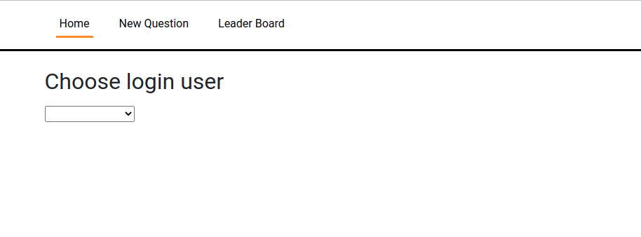
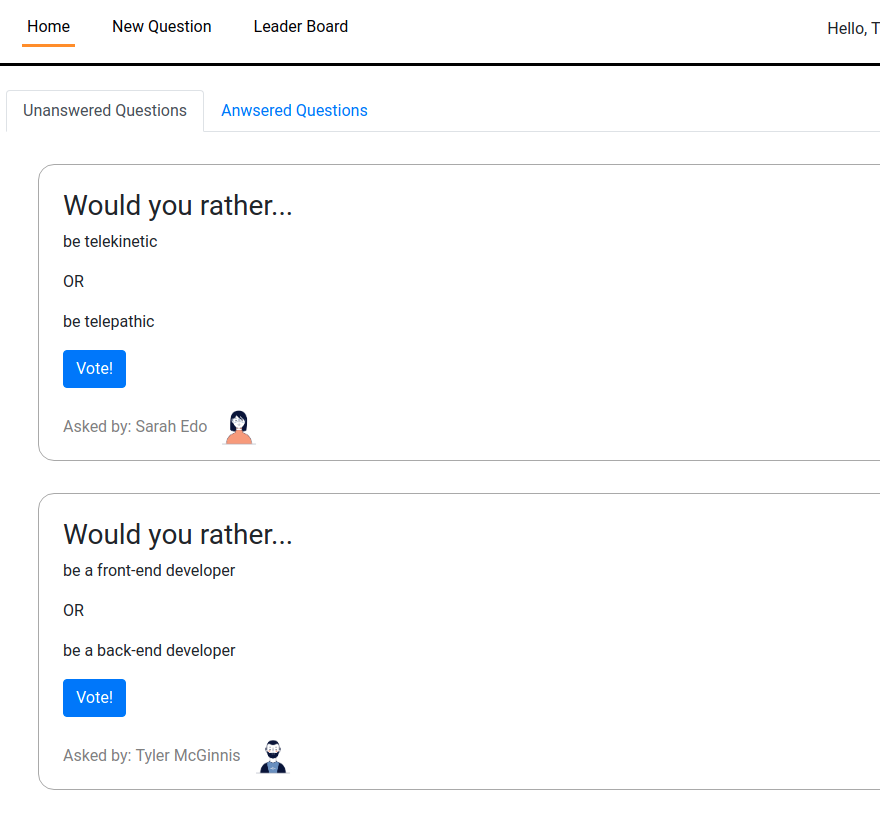
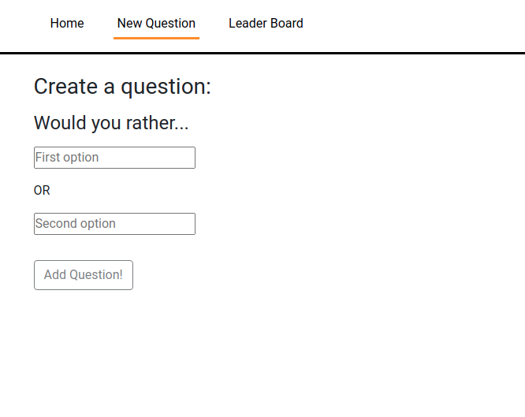
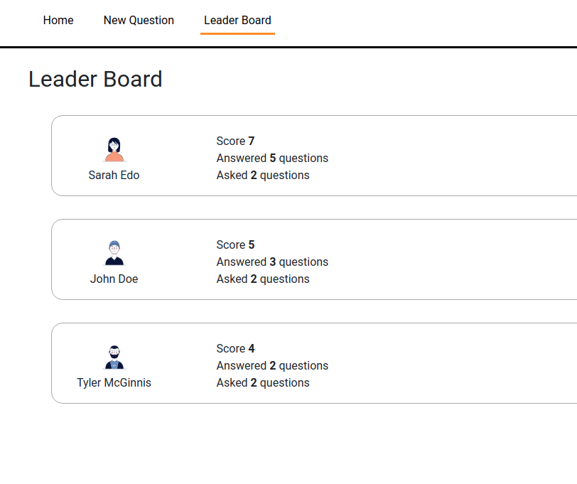

# Install & Run
Once you have a clone of this repository, install the necessary dependencies by running `npm install` and run it locally with `npm start`

Note: Node 14.XX is required to run this project.

# Would You Rather?

## Preface
This is a project I completed for udacity.com's 'React nano degree' program. The mock database, the `src/utils/_DATA.js` file, and the idea for this project was provided by udacity.com and I did the rest!

## Note on quality
If any potential employers are looking at this project: please note that I completed this project to the minimal quality standard. I learned what I wanted to learn making this project and didn't spend more time on it than I needed - that leaves more time for other projects!

Some areas that could be improved
 * Everything UI
 * Make pages responsive

## Would you rather? - A game outline
This is a simple 'poll' game where you can ask whether you prefer `option A` or `option b`. For example: Would you rather `Eat a whole pizza` or `Eat a whole pie`?

## Login functionality
Since there is no real back-end for this application, the login process is simply choosing which user you want to be from the drop-down menu.

## The pages
### Home
On the home page there is a tabbed view of all unanswered and answered questions.

You can click 'Vote!' on unanswered questions to select your preference and click 'View results' on answered questions to see how that user voted and statistics on how others voted.

### New Question
Here you can add a new question.

### Leader Board
Here you can see which users are most active - who has asked and answered the most questions

## There is more!
Please checkout the rest of the functionality by cloning and running the app locally!

## Technical stuff

### Implementation
This is a 'built from scratch' React.js SPA (single page application) that uses react, react router, redux, react bootstrap in some places and some basic scss.

### Folder structure
The source code is organized in a 'rails-like' pattern. Actions, components middleware and reducers each have their own folders. My preference for organizing the files this way helps prevent a react anti-pattern where the UI is tightly coupled with the action/reducer implementation. Having the different aspects of the program handled in their own folder promotes decoupling.

### Areas to improve
As of writing this, I know I don't totally understand how promises and callback handling works after dispatching a state change. Also, this course doesn't talk about react hooks at all. I use a couple hooks in the app but don't know a lot about them. I'm looking forward to researching these topics soon!
